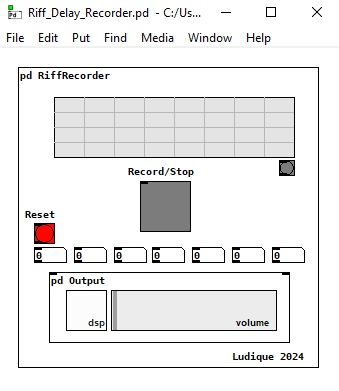

## Qué es esto?
Este proyecto fue desarrollado por encargo de la Facultad de Arquitectura de la Universidad de las Américas.
Consiste en un parche programado usando PlugData que permite grabar una secuencia ritmica con el fin de generar un patrón de delay.

[Comprehensive Markdown Crash Course](https://www.youtube.com/watch?v=FEa2diI2qgA "Título alternativo")

https://youtu.be/7P64u9kcFVU
